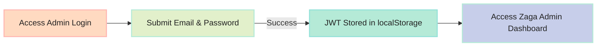

# Standalone Zaga Admin Console User Guide

Complete operational manual for managing the Raghuvir Consultants advisory platform via `http://app.raghuvircons.local/` (or `/adminDashboard`).

---

## 1. Authentication & Access
- **URL**: `http://app.raghuvircons.local/login` (or `http://raghuvircons.local/adminDashboard`)
- **Default Admin Email**: `admin@raghuvir.com`
- **Default Admin Password**: `admin12345`

---

## 2. Navigating Categorized Admin Sections

The left sidebar is organized into 5 distinct operational categories:

### Category 1: Dashboard
- **Home Overview**: View real-time database health, active investor metrics, total research publications, model portfolio stock count, and blog post numbers.

### Category 2: Investors
- **Investor Users Manager**:
  - View all registered investors.
  - Search by username or email.
  - Manage account status: **Activate**, **Disable** (suspends access), or **Blacklist**.
  - Reset investor password or view subscription history.

### Category 3: Site Static Content
- **Blog Posts**:
  - Click **Create Blog Post** to open full-page editor.
  - Enter Article Title, URL Slug, Comma-Separated Tags (`#Equities`, `#Market`), and Markdown body.
  - Toggle between **Write**, **Live Preview**, and **Split Mode**.
- **Services Offered**:
  - Manage monthly pricing tiers (e.g. ₹999/mo for Research Reports, ₹1,999/mo for Model Portfolio).
- **Smallcases**:
  - Manage quantitative theme offerings (e.g. All Weather Investing, CAGR %, Minimum Investment).

### Category 4: Premium Subscription
- **Research Reports**:
  - Publish institutional equity research reports accessible only to subscribed investors.
- **Model Portfolio**:
  - Add/Edit stock holdings (Ticker, Entry Price, Target Price, Stop Loss, Weightage %).

### Category 5: Misc
- **News Feed**: Publish market updates shown on public & investor feeds.
- **Alerts & Announcements**: Broadcast global advisory notifications to all investor dashboards with workflow states (`Draft`, `Published`, `Archived`).
- **System Telemetry Status**: View real-time API version, MongoDB ping speed in `ms`, CPU load %, and memory telemetry.

---

## 3. Managing Admin Profile & Credentials
1. Click the **Admin Profile Avatar Card** at the bottom of the left sidebar.
2. Select **Edit Admin Profile** from the popover menu.
3. Update username or change password (must satisfy policy: min 7 chars with `!@#$%`).
4. Click **Save Profile Changes**.
